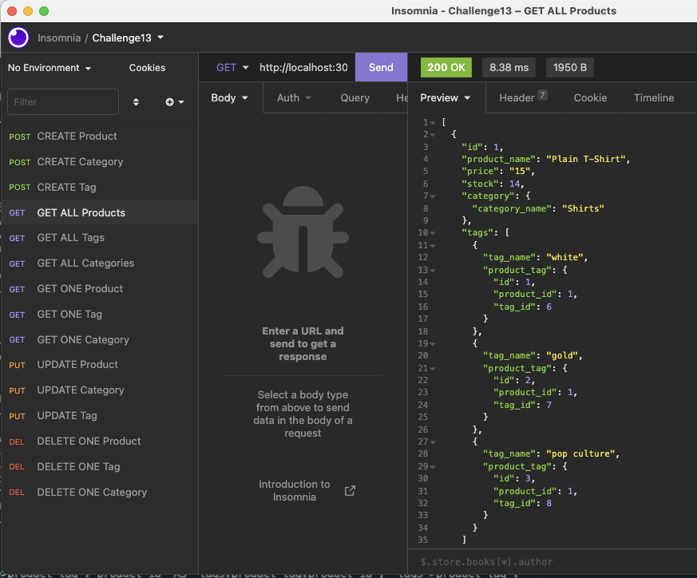

<h1 align="center">eCommerce backEnd</h1>
  
<p align="center">
    
    
    
    
</p>
  
<p align="center">
    
    
    
    
    
</p>

<br/>

   
## Description

🔍 An eCommerce server running on  mysql database. Built using MySQL2, Express, Sequelize and dotenv.
  
  
## User Story
  
```
AS A manager at an internet retail company
I WANT a back end for my e-commerce website that uses the latest technologies
SO THAT my company can compete with other e-commerce companies
```
  
## Acceptance Criteria
  
``` 
GIVEN a functional Express.js API
WHEN I add my database name, MySQL username, and MySQL password to an environment variable file
THEN I am able to connect to a database using Sequelize
WHEN I enter schema and seed commands
THEN a development database is created and is seeded with test data
WHEN I enter the command to invoke the application
THEN my server is started and the Sequelize models are synced to the MySQL database
WHEN I open API GET routes in Insomnia for categories, products, or tags
THEN the data for each of these routes is displayed in a formatted JSON
WHEN I test API POST, PUT, and DELETE routes in Insomnia
THEN I am able to successfully create, update, and delete data in my database
```
  
## Table of Contents
- [Description](#description)
- [User Story](#user-story)
- [Acceptance Criteria](#acceptance-criteria)
- [Table of Contents](#table-of-contents)
- [Installation](#installation)
- [Usage](#usage)
- [Testing](#testing)
- [Contributing](#contributing)
- [Questions](#questions)

## Installation
💾   

`npm install`
  
## Usage
💻   
  
Run the following command at the root of your project and answer the prompted questions:

`mysql -u root -p`

Enter PW when promted

`source db/schema.sql`

`quit`

`npm run seed`
  
`npm start`

## Testing
✏️

No testing is currently set up

## Contributing
Bootcamp Spot
Rich Stanbaugh


  ## Questions
  If you  hvae questions, you can:
  - :eyes: Find me on GitHub: [rstanbaugh@gmail.com](https://github.com/rstanbaugh@gmail.com), or<br />
  - :email: Email me: rich_bootcamp@icloud.com<br /><br />

  _This README was generated with :heart: by [README-generator](https://github.com/rstanbaugh/README-Generator) :fire: :fire:_
